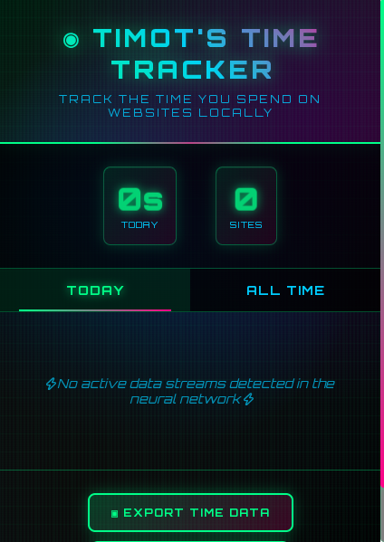
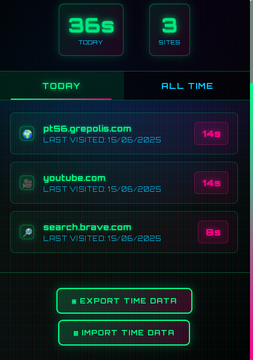

# ⏱️ Timot Time Tracker

**Track how you spend time on websites — privately, locally, and beautifully.**

Timot's Time Tracker is a Chrome extension that logs how much time you spend on different websites — all locally on your machine. No accounts, no sync, no spying. Just you and your data. This extension contains AI code.





---

## ✨ Features

- 📊 **Website Usage Tracking**  
  Automatically tracks how long you spend on each website in real-time.

- 🔒 **Privacy-First**  
  All your data stays in Chrome’s local storage — no servers, no tracking.

- 🌙 **Idle Detection**  
  Smartly pauses tracking when you're idle or the browser loses focus.

- 🗂️ **Daily & Total Stats**  
  View daily and all-time usage across sites in a visually rich popup.

- 📤 **Export / Import**  
  Easily back up or restore your time data in JSON format.

- 🖼️ **Cyberpunk-Inspired UI**  
  Beautiful, animated interface with a retro-futuristic design.

---

## 🚀 Installation

1. Download or clone this repository:
   ```bash
   git clone https://github.com/timotofcourse/timot-time-tracker.git

2. Open Chrome and go to:
    ```
    chrome://extensions

3. Enable Developer Mode (top right), then click "Load unpacked".

4. Select the root folder of this project.

5. You're good to go!

In the future this extension will be in the chrome web store but for now this is the only installation method

---

## 🔧 How It Works

- A background service worker (background.js) listens for tab and idle events.

- When you switch tabs or go idle, it logs time spent per domain.

- Data is stored in chrome.storage.local and displayed via the popup interface.

- The UI (in popup.html) shows stats for today and all-time, styled with a custom cyberpunk theme.

---

## 🛠 Permissions

- The extension requests the following Chrome permissions:

- tabs – to monitor tab activity

- storage – to persist tracking data

- idle – to detect user inactivity

- activeTab – to access info on the active tab

- <all_urls> – to track time spent across all websites

---

## 📤 Data Export / Import

Click the Export button in the popup to download your usage history as a .json file.

To import:

- Click Import, then select a previously saved JSON file.
